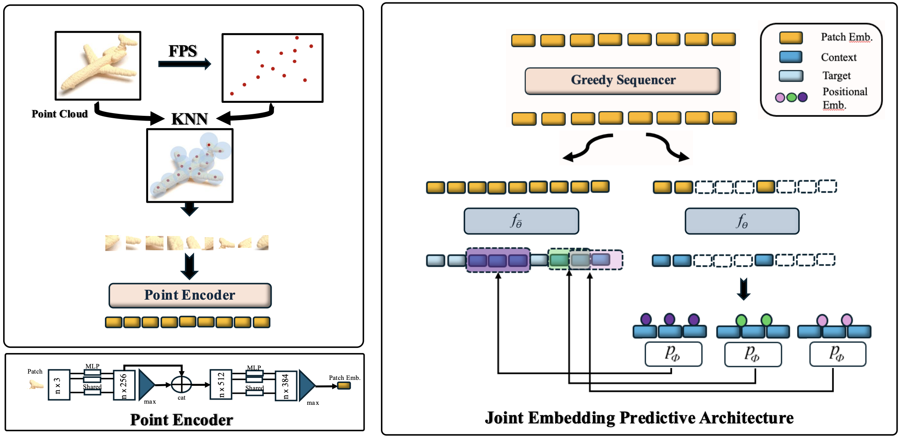

# Point-JEPA

[](https://paperswithcode.com/sota/3d-point-cloud-linear-classification-on?p=point-jepa-a-joint-embedding-predictive)
[](https://paperswithcode.com/sota/few-shot-3d-point-cloud-classification-on-3?p=point-jepa-a-joint-embedding-predictive)
[](https://paperswithcode.com/sota/few-shot-3d-point-cloud-classification-on-2?p=point-jepa-a-joint-embedding-predictive)

We propose a joint embedding predictive architecture (JEPA) for point cloud self-supervised learning. 
Our method efficiently computes and utilizes the proximity of point cloud patch embeddings based on their indices during target and context selection. 
The sequencer allows shared computations of the patch embeddings' proximity between context and target selection, further improving efficiency. 
Please refer to the [paper](https://arxiv.org/abs/2412.05555) for more details.



## Installation

### 1. Dependencies
- Python 3.10.4
- CUDA 11.6 or above
- cuDNN 8.4.0 or above
- GCC >= 6 and <= 11.2.1

```bash
./install_py.sh
```

### 2. Datasets

See [DATASETS.md](DATASETS.md) for download instructions.

### 3. Check (optional)

```bash
python -m pointjepa.datasets.process.check # check if datasets are complete
python -m pointjepa fit -c configs/Point-JEPA/pretraining/shapenet.yaml
```

## Model Zoo


| Type                         | Dataset      | Evaluation                          | Config                                                                                       | Checkpoint                                                                                                                                    |
| ---------------------------- | ------------ | ----------------------------------- | -------------------------------------------------------------------------------------------- | --------------------------------------------------------------------------------------------------------------------------------------------- |
| Point-JEPA pre-trained        | ShapeNet     | -                                   | [config](configs/Point-JEPA/pretraining/shapenet.yaml)                                                  | [checkpoint](https://drive.google.com/file/d/1MR3OYA6N0TINyPCKgwOU3zswQoM8DXbY/view?usp=drive_link)                          |
| Point-JEPA SVM Linear | ShapeNet     | **93.7&pm;0.2**                                   | -                                                  | [checkpoint](https://drive.google.com/file/d/1MR3OYA6N0TINyPCKgwOU3zswQoM8DXbY/view?usp=drive_link)                          |
| Classification fine-tuned    | ModelNet40   | **93.8&pm;0.2** / **94.1&pm;0.1** (OA / Voting) | [config](configs/Point-JEPA/classification/modelnet40.yaml)   | [checkpoint](https://drive.google.com/file/d/1EOiHBu06pRah2MRlEapPQmks3BmjXgbB/view?usp=sharing)         |
| Classification fine-tuned    | ScanObjectNN | **86.6&pm;0.3** (OA)                      | [config](configs/Point-JEPA/classification/scanobjectnn.yaml) | [checkpoint](https://drive.google.com/file/d/1vnhQdVBliGxQ09vazZCuOlFsgBAThlqg/view?usp=sharing)       |
| Part segmentation fine-tuned | ShapeNetPart | **85.8&pm;0.1** (Cat. mIoU)               | [config](configs/Point-JEPA/part_segmentation/shapenetpart.yaml)                                        | [checkpoint](https://drive.google.com/file/d/1lS1_lKTsaTgQ4MCucfSCkmNyhLAgaxG7/view?usp=sharing) |


Please note that weights that are attached above are the ones that yields the best results out of 10 independent runs (details mentioned in the paper).

## Reproducing the results from the paper

The scripts in this section use Weights & Biases for logging, so it's important to log in once with `wandb login` before running them.
Checkpoints will be saved to the `artifacts` directory.

**A note on reproducibility:**
While reproducing our results on most datasets is straightforward, achieving the same test accuracy on ModelNet40 is more complicated due to the high variance between runs (see also https://github.com/Pang-Yatian/Point-MAE/issues/5#issuecomment-1074886349, https://github.com/ma-xu/pointMLP-pytorch/issues/1#issuecomment-1062563404, https://github.com/CVMI-Lab/PAConv/issues/9#issuecomment-886612074).
To obtain comparable results on ModelNet40, you will likely need to experiment with a few different seeds (This is the motivation behind multiple runs in our paper).
However, if you would like to precisely replicate our test environment, you can try the following

We used a mixture of  two environments (compute canada and the other), [Narval](https://docs.alliancecan.ca/wiki/Narval/en) server and another. Narval server was used for pretrainng and the other server was used specifically for downstream tasks. 

##### For pre-training (compute canada)
- Python 3.10.2
- CUDA 11.4 
- on A100SXM4

##### For downstream tasks
- Python 3.10.2
- CUDA 11.8
- on RTX 5500  

## Acknowledgements

This codebase is built upon [Point2Vec](https://github.com/kabouzeid/point2vec) and draws inspiration from [PointGPT](https://github.com/CVMI-Lab/PointGPT)'s efficient point ordering implementation. We thank the authors of both repositories for their contributions.

## Citation

You can cite our paper as follows:

```bibtex
@inproceedings{pointjepa2025,
    title={Point-JEPA: Joint Embedding Predictive Architecture for 3D Point Cloud Self-supervised Learning},
    author={Saito, Ayumu and Kudeshia, Prachi and Poovvancheri, Jiju},
    booktitle={IEEE/CVF Winter Conference on Applications of Computer Vision (WACV)},
    year={2025}
}
```
